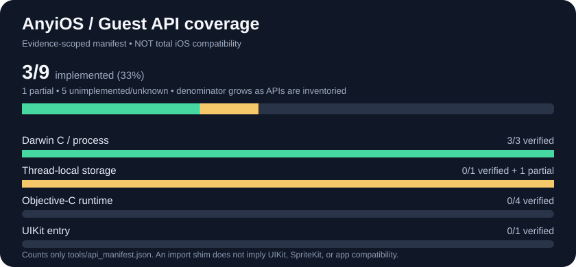

# AnyiOS

Research into a clean-room compatibility layer for legally accessible, unprotected ARM64 iOS application binaries on non-Apple operating systems.

**Current status:** AnyiOS can inspect ARM64 Mach-O metadata and execute a project-owned compiled ARM64 Mach-O function on Windows x86-64 through Dynarmic. A restricted synthetic executable loader, experimental Darwin syscall bridge, and limited dyld dependency planner exist. **It cannot currently launch a complete iOS `.app`.**

## Status

 

* **iOS APIs:** explicitly inventoried candidate exports in [19 API families](tools/api_inventory.json); **runtime:** implementation gates covering [53 subsystems](tools/compat_capabilities.json). Green = narrowly verified with evidence, amber = partial, gray = pending or unverified. Partial implementations are **not** counted as complete. These totals are **not all Apple APIs, all iOS versions, or a percentage of iOS app compatibility**. They grow as real binaries and frameworks reveal more requirements. Read the [full function-by-function and gate-by-gate GitHub checklist](docs/progress.md) and [counting rules](_docs/PROGRESS.md).*

**High-coverage original application stress target:** [Wikipedia for iOS (MIT, original upstream commit)](compatibility/targets/wikipedia-ios.json) — [reproducible unmodified ARM64 iPhoneOS build and honest static-gap workflow](_docs/WIKIPEDIA_TARGET.md). **Neither a Windows launch nor guest-originated pixels have been verified.** A match to the tracked candidate API symbols or runtime gates is **not** automatic compatibility. Test the original app on both Windows architectures before promoting any count.

**Additional protected-game research target:** [Sneaky Sasquatch — unchanged-binary intake](compatibility/targets/sneaky-sasquatch.json). This Apple Arcade game has **not** been obtained or launched. The [read-only original IPA inspection tool](tools/unchanged_ipa_probe.py) reports missing/incompatible APIs without modifying game files or bypassing protection. [App compatibility evidence](_docs/APP_COMPATIBILITY.md).

**Latest owned execution milestone:** [three-image dependency-first C constructors](_docs/MULTI_IMAGE_INITIALIZERS.md) ran under Windows x64 Dynarmic and returned 735 in [CI 37974381605](https://github.com/uknes/AnyiOS/actions/runs/37974381605). Windows/Linux ARM64 verified the host planning contracts; native execution of this constructor chain is not claimed.

## Cross-app iOS requirements — research snapshot 2026-10-09

The SVG above now includes **575 runtime/behavior gates across 53 subsystems**, the existing **269 selected API exports**, and a separate **405-entry Apple technology discovery panel**. New requirements are pending; existing evidence and verified counts are unchanged. Wikipedia is one stress target, not a runtime specialization.

The expanded gates cover loading, CPU/ABI, Darwin/Mach/XPC, C/C++/Objective-C/Swift, SwiftUI, resources, persistence, graphics/games, media, browsers/networking, sensors/accessories, AI, personal data, extensions, continuity, commerce, privacy and security. See the [full requirements and blocker policy](docs/ios-requirements.md), [gate checklist](docs/progress.md), and [linked Apple technology catalog](docs/apple-technologies.md).

**External dependencies are included:** Apple account and backend services, APNs, iCloud, StoreKit, Game Center, Apple Pay, App Attest, Secure Enclave/Element, licensed AI models, protected media, MFi, device sensors and restricted entitlements. Some require authorized services or real hardware; some may remain unavailable on Windows. Tracking them is not a promise to reproduce Apple trust or bypass protection.

**Scope is open-ended.** The Apple catalog contains other-platform frameworks, developer tools and server APIs, explicitly marked *applicability unassessed*, rather than falsely declaring every entry an iOS dependency. The source pages currently expose iOS 27/WWDC26 topics with beta labels; these are research candidates, not a verified final-release SDK baseline. Every specific app needs its own iOS version, imports, dynamic selectors, Swift ABI, resources, entitlements, device features and server behavior audited. No exhaustive inventory of every 2026 app or every Apple symbol has been established. SDK and lawful unchanged-binary intake must continue adding requirements.

## Build and test

Requires CMake 3.20+ and a C++20 compiler (Linux GCC/Clang, Windows MSVC, and macOS Clang are tested).

    cmake -S . -B build -DBUILD_TESTING=ON
    cmake --build build --config Debug --parallel
    ctest --test-dir build --build-config Debug --output-on-failure

## Inspector

    ./build/anyios-inspect path/to/owned-unprotected-arm64-macho

On Windows use the generated anyios-inspect executable inside the configured build directory. The inspector accepts thin little-endian ARM64 Mach-O and ARM64 slices in FAT/FAT64 universal binaries (including swapped-endian tables). It also lists section_64 and LC_SYMTAB metadata, dyld chained-import names, and export-trie names. Other CPUs and malformed inputs are rejected. Exit codes: 0 valid unprotected metadata, 1 input/usage error, 2 unsupported/malformed format, 3 encrypted-code indicator. Inspecting a file does not mean it is executable or is an iOS device application.

## Real compiler fixture and fuzzing

On Linux with Clang and Python 3 installed:

    python3 tests/real_fixture.py build/anyios-inspect

To build the dedicated Clang/libFuzzer test target:

    cmake -S . -B build-fuzz -DCMAKE_CXX_COMPILER=clang++ -DANYIOS_BUILD_FUZZER=ON -DBUILD_TESTING=OFF
    cmake --build build-fuzz --target anyios-fuzz
    python3 tests/fuzz_corpus.py build-fuzz/corpus
    ./build-fuzz/anyios-fuzz build-fuzz/corpus -runs=10000 -max_len=4096

Neither inspection nor successful fuzzing constitutes guest-code execution.

## Windows x64 CPU translation experiment

The optional Dynarmic backend is pinned to revision a46601580d5512d324104f985b5f0209dc980ddc (0BSD license). It can translate ARM64 guest instructions on Windows x86-64; Boost headers and Git are needed to build the dependency.

    cmake -S . -B build-jit -DANYIOS_WITH_DYNARMIC=ON -DBUILD_TESTING=ON
    cmake --build build-jit --config Release --target anyios-a64-smoke
    ctest --test-dir build-jit --build-config Release -R arm64-on-x64 --output-on-failure

The tests execute embedded instructions and compiler-generated ARM64 Mach-O MH_OBJECT functions; an additional SVC fixture exercises a bounded Darwin write bridge. A synthetic no-import MH_EXECUTE is mapped into guest memory, but **real linked iOS apps and frameworks do not execute**. Dynarmic is fetched externally, not copied into the repo.

## Limited dyld binding research

The experimental dyld modules can plan generic 64-bit chained rebases/binds and resolve a narrow subset of imported symbols against pre-registered, project-owned dylibs. They stage patches atomically; they do **not** run dependent iOS apps or implement Apple frameworks. See [_docs/DYLD_FIXUPS.md](_docs/DYLD_FIXUPS.md).

## Parallel ARM64 host development

Native ARM64 proof-of-execution is tested on **Windows ARM64** and **Linux ARM64**, alongside Dynarmic translation on Windows x86-64. The native test executes only a project-owned, two-instruction ARM64 function from a compiler-built iOS Mach-O object. It is not arbitrary application execution. See [_docs/ARM64_HOSTS.md](_docs/ARM64_HOSTS.md).

## Clean-room dependency and ABI research

See [_docs/OSS_SURVEY.md](_docs/OSS_SURVEY.md) for the verified-license survey (23 projects) and ranked integration experiments; see [_docs/ABI_BRIDGE.md](_docs/ABI_BRIDGE.md) for ARM64 ABI, SVC, sandboxing and thunk prerequisites.

## Project documentation

- [_docs/STATE.md](_docs/STATE.md) — verified state and next milestone
- [_docs/MULTI_IMAGE_INITIALIZERS.md](_docs/MULTI_IMAGE_INITIALIZERS.md) — bounded dependency-first constructor planning and owned ARM64 acceptance
- [_docs/BUNDLE_DEPENDENCY_INTAKE.md](_docs/BUNDLE_DEPENDENCY_INTAKE.md) — bounded original bundle metadata discovery and atomic image sets
- [_docs/WINDOWS_X64.md](_docs/WINDOWS_X64.md) — Windows ARM64 translation architecture and restrictions
- [_docs/ARCHITECTURE.md](_docs/ARCHITECTURE.md) — implementation boundaries
- [_docs/M2_FEASIBILITY.md](_docs/M2_FEASIBILITY.md) — evidence-based execution feasibility
- [_docs/ROADMAP.md](_docs/ROADMAP.md) — acceptance-based phases
- [_docs/DARWIN_RUNTIME.md](_docs/DARWIN_RUNTIME.md) — syscall boundary and dyld dependency architecture
- [_docs/DECISIONS.md](_docs/DECISIONS.md) — architectural decisions
- [_docs/RESEARCH.md](_docs/RESEARCH.md) — research, prior art and sources
- [_docs/TESTING.md](_docs/TESTING.md) — test method and requirements
- [_docs/SECURITY.md](_docs/SECURITY.md) — threat model and lawful-input policy

## Compatibility and licensing

Only project-owned or explicitly redistributable unprotected binaries should be used. No firmware, cryptographic keys, protected retail apps, DRM-bypass tooling, or proprietary Apple binaries are provided. Source is licensed under MIT. We studied [AnyPS5](https://github.com/boykopovar/AnyPS5) for engineering patterns without copying its GPL-licensed code.

Verified Windows CPU/JIT execution and ordinary CI: https://github.com/uknes/AnyiOS/actions/runs/37710397827. New runtime and dyld tests require separate successful CI before being marked verified.